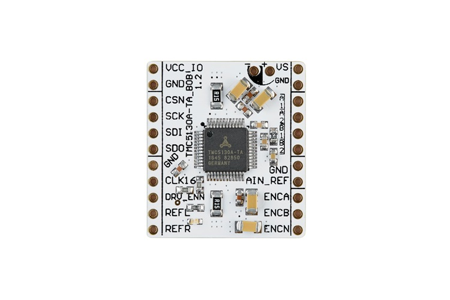

# Trinamic TMC5130 Arduino Library
Arduino library for the Trinamic TMC5130 stepper motor driver.

### Related products
|  |
|:--:|
| *<a href="https://www.analog.com/en/resources/evaluation-hardware-and-software/evaluation-boards-kits/tmc5130a-bob.html">TMC5130A-BOB</a>* |

### Supported interfaces
| Interface | Status |
|-----------|:------:|
| UART | ❌ |
| SPI | ✔️ |

### Disclaimer
Because this library uses bitfields, you might have to add the `-Wno-packed-bitfield-compat` compile flag to remove warnings.

### Credits
* https://github.com/mikest/Estee_TMC5130
* https://github.com/tommag/TMC5160_Arduino
